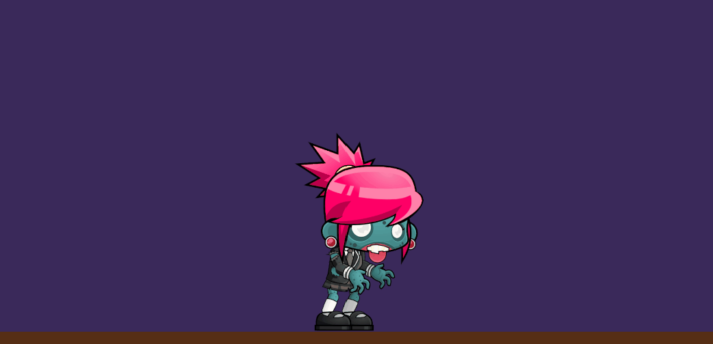
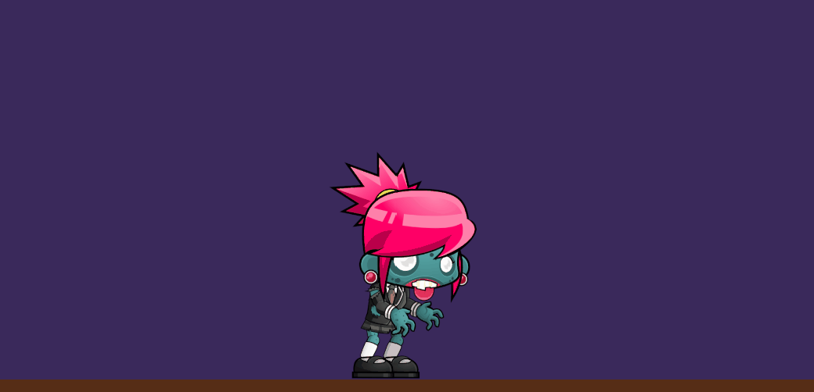
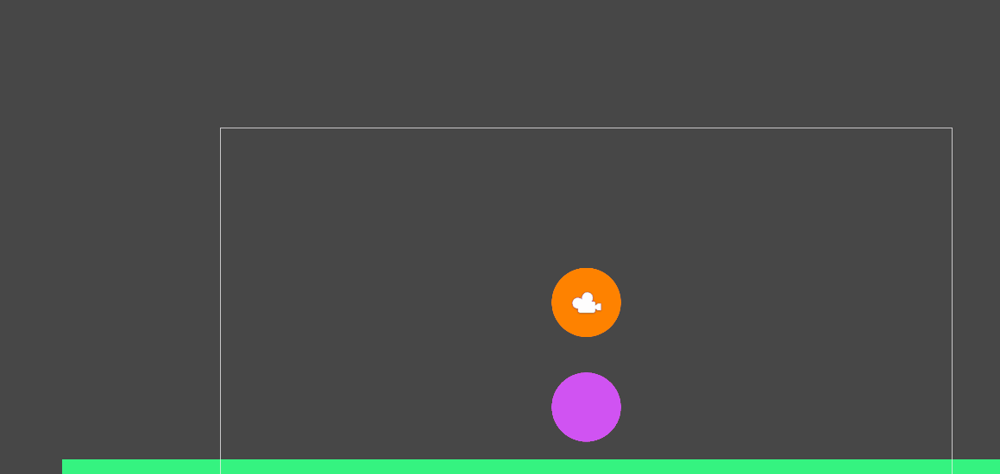

# programacion-de-juegos-2D-Sprites

## Controlar el movimiento del personaje zombie:

-> Obteniendo el input de los controler para movernos horizontalmente:

´´´
void Update(){ 
        inputHorizontal = Input.GetAxisRaw("Horizontal");
}
´´´

-> Podremos mover al personaje añadiendo una fuerza en la dirección que nos indiquen.



## Hacer una versión del zombie con salto:

-> Aparte de añadir una fuerza en el eje Y positivo, necesitamos saber si el zombie esta actualmente en el suelo o esta saltando para evitar que flote para siempre,
para ello creamos un booleano que cambie a false cuando colisione con el suelo y a true cuando salga de esa colisión.

```
void OnTriggerEnter2D(Collider2D other) {
        if(other.gameObject.tag == "Platform"){
            isJumping = false;
        }
    }

        void OnTriggerExit2D(Collider2D other) {
        if(other.gameObject.tag == "Platform"){
            isJumping = true;
        }
}
```


## Cambiar la dirección del sprite usando Flip X:

-> Miramos cual es el input actual en el movimiento horizontal ( 1 o -1 ) y al spriteRenderer le cambiamos flipX a true o a false.



## Animaciones del personaje cuando camina:


## Animaciones del personaje cuando choca con otro zombie:


## Animaciones Goblin, activar la animación del ataque del Goblin al colisionar con el Zombie:


## Elemento decorativo para crear un Joint:


## Prueba de física 2D:

### 1 Ninguno de los objetos será físico.

-> Los objetos permanecen quietos al no verse afectados por ninguna física.



### 2 Un objeto tiene físicas y el otro no.

-> El que tiene físicas cae al tener gravedad, el otro permanece quieto.


### 3 Ambos objetos tienen físicas.

-> Ambos caen por la fuerza de la gravedad.


### 4 Ambos objetos tienen físcas y uno de ellos tiene 10 veces más masa que el otro.

-> El de color rosado tiene 10 veces mas masa que el naranja por lo que apenas se mueve al chocar.


### 5 Un objeto tiene físicas y el otro es IsTrigger.

-> Como el objeto naranja atraviesa al rosado al ser este ultimo un Trigger.


### 6 Ambos objetos son físicos y uno de ellos está marcado como IsTrigger.

-> Ambos tienen físicas y caen, pero el objeto rosado al ser Trigger atraviesa el suelo.


### 7 Uno de los objetos es cinemático.

-> Al ser cinemático, este permanece quieto y el objeto naranja choca con el.


