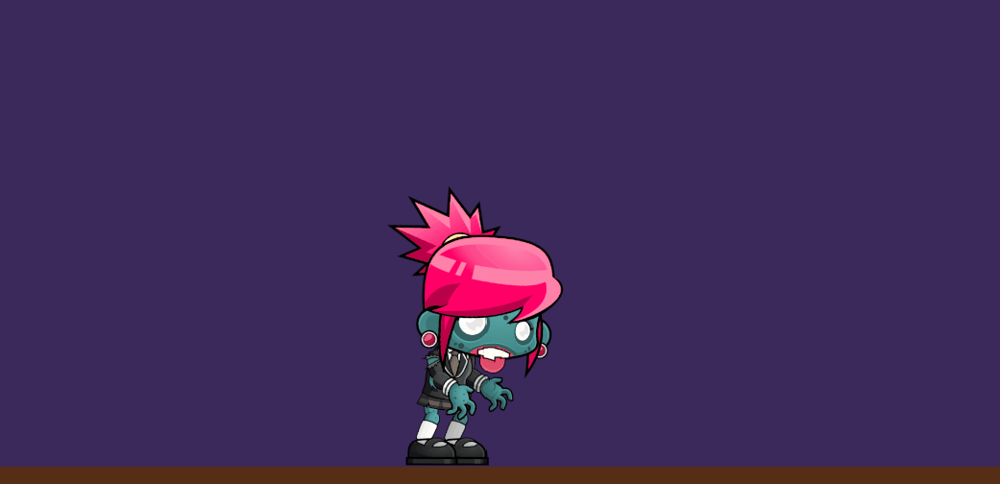
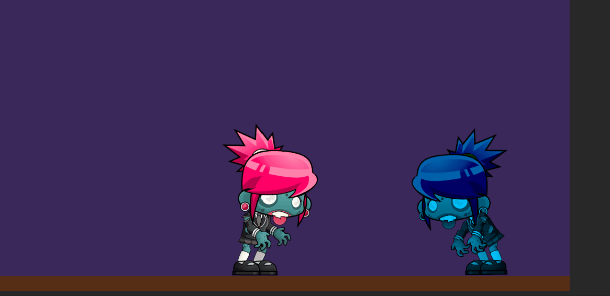

# programacion-de-juegos-2D-Sprites

## Controlar el movimiento del personaje zombie:

## Hacer una versión del zombie con salto:

## Cambiar la dirección del sprite usando Flip X:

## Animaciones del personaje cuando camina:

## Animaciones del personaje cuando choca con otro zombie:

## Animaciones Goblin, activar la animación del ataque del Goblin al colisionar con el Zombie:

## Elemento decorativo para crear un Joint:

## Prueba de física 2D:

### 1 Ninguno de los objetos será físico.

### 2 Un objeto tiene físicas y el otro no.

### 3 Ambos objetos tienen físicas.

### 4 Ambos objetos tienen físcas y uno de ellos tiene 10 veces más masa que el otro.

### 5 Un objeto tiene físicas y el otro es IsTrigger.

### 6 Ambos objetos son físicos y uno de ellos está marcado como IsTrigger.

### 7 Uno de los objetos es cinemático.

